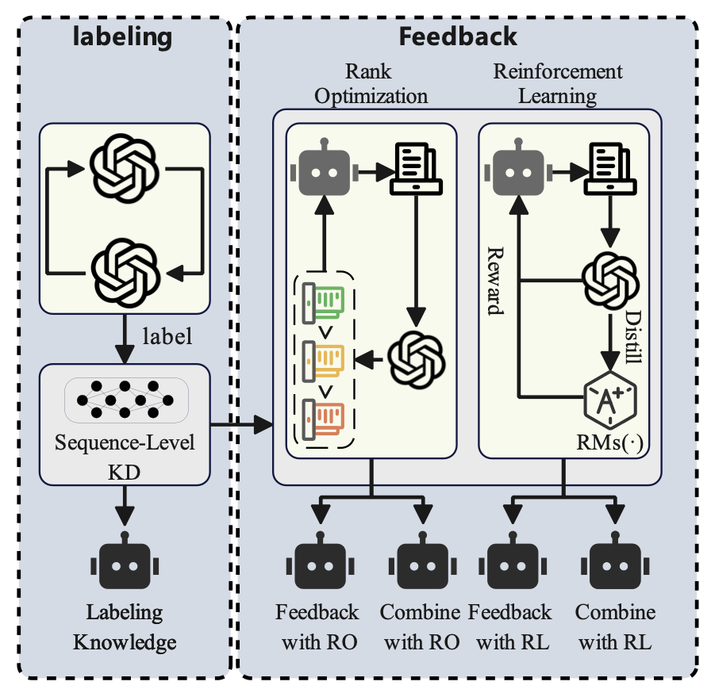

<!-- ::: {.callout-note appearance="minimal" icon=false}
**\*** denotes equal contribution &nbsp;|&nbsp; **†** denotes corresponding author &nbsp;|&nbsp; <i class="bi bi-link-45deg"></i> [Google Scholar](https://scholar.google.com/) &nbsp;|&nbsp; <i class="bi bi-github"></i> [GitHub](https://github.com/VodkaVortex)
::: -->

## Selected Publications {.unnumbered}

Click **Details** to view each paper’s methodology diagram, key findings, and all related resource links.

---

### 2025 {.unnumbered}

::: {.publication-card}

:::: {.grid}

::: {.g-col-12 .g-col-md-4}
{.pub-teaser fig-align="center"}
:::

::: {.g-col-12 .g-col-md-8}

#### WHAT IS THE RISK? EVALUATING THE IMPACT OF KNOWLEDGE DISTILLATION ON LLM VULNERABILITIES {.unnumbered}

[**First Author**]{.author-self} 
*ICASSP*, 2026 &nbsp;·&nbsp; **Accepted**

<a href="#" class="btn btn-outline-primary btn-sm" role="button"><i class="bi bi-file-earmark-pdf"></i> PDF</a>
<a href="#" class="btn btn-outline-secondary btn-sm" role="button"><i class="bi bi-github"></i> Code</a>
<a href="#" class="btn btn-outline-success btn-sm" role="button"><i class="bi bi-easel"></i> Slides</a>
<a href="#" class="btn btn-outline-warning btn-sm" role="button"><i class="bi bi-quote"></i> BibTeX</a>
<a href="#" class="btn btn-outline-info btn-sm" role="button"><i class="bi bi-link-45deg"></i> Link</a>

:::

::::

::: {.callout-tip collapse="true" icon=false}
## <i class="bi bi-chevron-expand"></i> Details, Figures & Tables

**Method Overview**

{#fig-iie-method width=90%}

**Key Results**


| Models | Human Judge ASR (Simple Query) | Human Judge ASR (GCG) | Human Judge ASR (AutoDAN) | Human Judge ASR (PAIR) | GPT-4 Judge ASR (Simple Query) | GPT-4 Judge ASR (GCG) | GPT-4 Judge ASR (AutoDAN) | GPT-4 Judge ASR (PAIR) |
|---|:---:|:---:|:---:|:---:|:---:|:---:|:---:|:---:|
| 7b (Base) | 8 | 77 | 84 | 82 | 34 | 54 | 90 | 87 |
| 7b (Labeling) | 79 | 86 | 93 | 94 | 85 | 88 | 99 | 100 |
| 7b (Feedback with PPO) | 64 | 82 | 91 | 95 | 98 | 92 | 100 | 97 |
| 7b (Feedback with DPO) | 73 | 80 | 94 | 92 | 97 | 94 | 98 | 96 |
| 7b (Combining with PPO) | 87 | 93 | 97 | 96 | 100 | 100 | 100 | 100 |
| 7b (Combining with DPO) | 85 | 94 | 99 | 96 | 91 | 96 | 100 | 100 |
| 13b (Base) | 2 | 3 | 31 | 3 | 0 | 4 | 45 | 5 |
| 13b (Labeling) | 5 | 16 | 48 | 17 | 11 | 13 | 46 | 15 |
| 13b (Feedback with PPO) | 4 | 14 | 55 | 24 | 12 | 12 | 59 | 27 |
| 13b (Feedback with DPO) | 3 | 10 | 55 | 19 | 19 | 12 | 53 | 25 |
| 13b (Combining with PPO) | 7 | 43 | 46 | 44 | 13 | 33 | 52 | 40 |
| 13b (Combining with DPO) | 5 | 35 | 63 | 56 | 14 | 36 | 57 | 41 |

: Table 1. Attack success rate (ASR) comparison across different distillation configurations under Human Judge and GPT-4 Judge evaluation. Joint knowledge combining methods (especially PPO/DPO-based combinations) substantially increase jailbreak susceptibility in both 7b and 13b models. {#tbl-asr-results}

**Abstract**

Knowledge distillation has significantly accelerated the devel- opment of efficient language models. With the rapid prolif- eration of these methods in the open-source communities, a systematic evaluation of their implications for model security is urgently needed. To quantify the security risks introduced by various distillation methods, we propose a general and exten- sible evaluation framework that reflects complex, real-world distillation workflows. Additionally, we analyze the impact of the distillation process on models’ tendencies toward harm- ful behavior by extending JailbreakBench with a harm-level dataset comprising 10 malicious query categories. Our results demonstrate that knowledge distillation significantly increases model vulnerability, and joint learning of the two primary forms of knowledge further exacerbates this risk. Furthermore, our analysis reveals different effects across harmful query cat- egories, with the risk levels of discrimination and economic harm showing significant increases that warrant particular at- tention.

**BibTeX**

```bibtex
@article{yang2025iie,
  title   = {IIE 往事},
  author  = {杨浩然 and 杨双宁},
  journal = {内部参考},
  year    = {2025},
  note    = {Accepted}
}
```
:::

:::

---

<!-- ============ 复制下面这一整段就可以新增一篇论文 ============ -->

::: {.publication-card}

:::: {.grid}

::: {.g-col-12 .g-col-md-4}
{.pub-teaser fig-align="center"}
:::

::: {.g-col-12 .g-col-md-8}

#### Paper Title Goes Here {.unnumbered}

Author One, [**杨双宁**]{.author-self}<sup>\*</sup>, Author Three<sup>†</sup>  
*Conference / Journal Name*, 2025 &nbsp;·&nbsp; **Under Review**

[`Topic A`]{.badge .bg-primary} [`Topic B`]{.badge .bg-success}

> 一句话描述（One-line takeaway）：本工作提出了 …，在 … 任务上比已有方法提升 X%。

<a href="#" class="btn btn-outline-primary btn-sm" role="button"><i class="bi bi-file-earmark-pdf"></i> PDF</a>
<a href="#" class="btn btn-outline-secondary btn-sm" role="button"><i class="bi bi-github"></i> Code</a>
<a href="#" class="btn btn-outline-success btn-sm" role="button"><i class="bi bi-globe"></i> Project</a>

:::

::::

::: {.callout-tip collapse="true" icon=false}
## <i class="bi bi-chevron-expand"></i> Details, Figures & Tables

放置该论文的详细介绍、方法图、消融实验表等。

:::

:::

---

